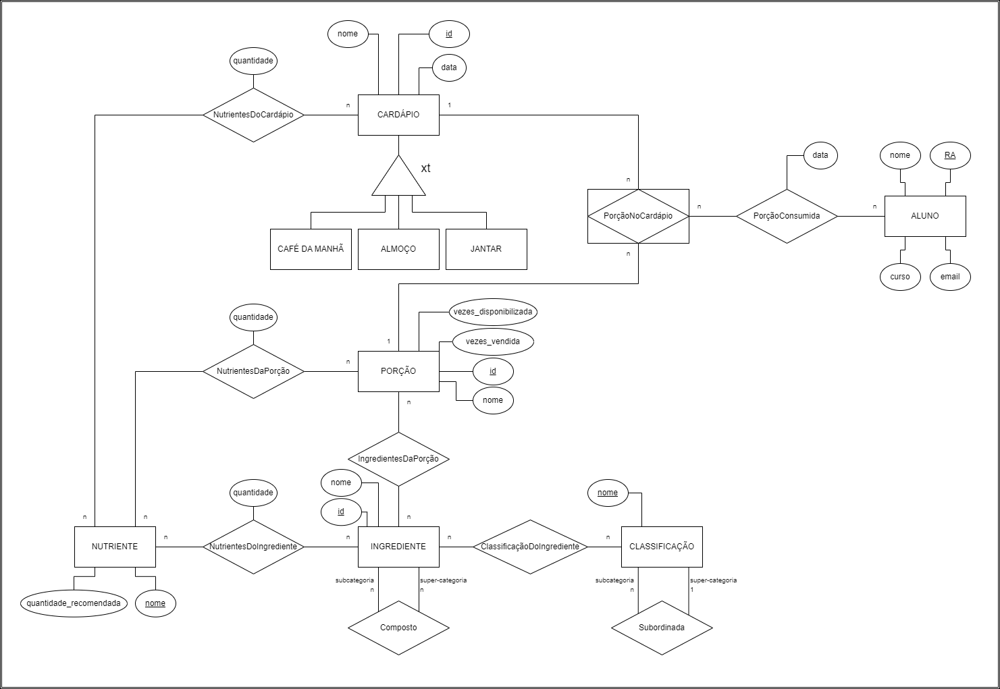

# Equipe `Analistas de Cardápios`

# Subgrupo `A`
* `Pedro Henrique Antoine Cortez Daccache` - `251572`
* `André Rodrigues Alves da Silva` - `231392`
* `Gabryel Rodrigues Alves da Silva` - `235394`

## Modelo Conceitual ER Revisado

*Diagrama ER Revisado*

## Mapeamento para o Modelo Relacional

~~~
CARDÁPIO(_Id_, Nome, Data, TipoCardápio)
PORÇÃO(_Id_, Nome, VezesVendida, VezesDisponibilizada)
INGREDIENTE(_Id_, Nome)
NUTRIENTE(_Nome_, QuantidadeRecomendada)
ALUNO(_RA_, Nome, Curso, Email)
CLASSIFICAÇÃO(_Nome_, Superior)

NUTRIENTESDOCARDÁPIO(_Cardápio_, _Nutriente_, Quantidade)
  Cardápio chave estrangeira -> CARDÁPIO(Id)
  Nutriente chave estrangeira -> NUTRIENTE(Nome)

NUTRIENTESDAPORÇÃO(_Porção_, _Nutriente_, Quantidade)
  Porção chave estrangeira -> PORÇÃO(Id)
  Nutriente chave estrangeira -> NUTRIENTE(Nome)

NUTRIENTESDOINGREDIENTE(_Ingrediente_, _Nutriente_, Quantidade)
  Ingrediente chave estrangeira -> INGREDIENTE(Id)
  Nutriente chave estrangeira -> NUTRIENTE(Nome)

INGREDIENTESDAPORÇÃO(_Porção_, _Ingrediente_)
  Porção chave estrangeira -> PORÇÃO(Id)
  Ingrediente chave estrangeira -> INGREDIENTE(Id)

COMPOSTO(_IngredienteComposto_, _IngredienteOriginal_)
  IngredienteComposto chave estrangeira -> INGREDIENTE(Id)
  IngredienteOriginal chave estrangeira -> INGREDIENTE(Id)

CLASSIFICAÇÃODOINGREDIENTE(_Ingrediente_, _Classificação_)
  Ingrediente chave estrangeira -> INGREDIENTE(Id)
  Classificação chave estrangeira -> CLASSIFICAÇÃO(Nome)

PORÇÃONOCARDÁPIO(_Cardápio_, _Porção_)
  Cardápio chave estrangeira -> CARDÁPIO(Id)
  Porção chave estrangeira -> PORÇÃO(Id)

PORÇÃOCONSUMIDA(_Aluno_, _Cardápio_, _Porção_, Data)
  Aluno chave estrangeira -> ALUNO(RA)
  (Cardápio, Porção) chave estrangeira -> PORÇÃONOCARDÁPIO(Cardápio, Porção)
~~~
