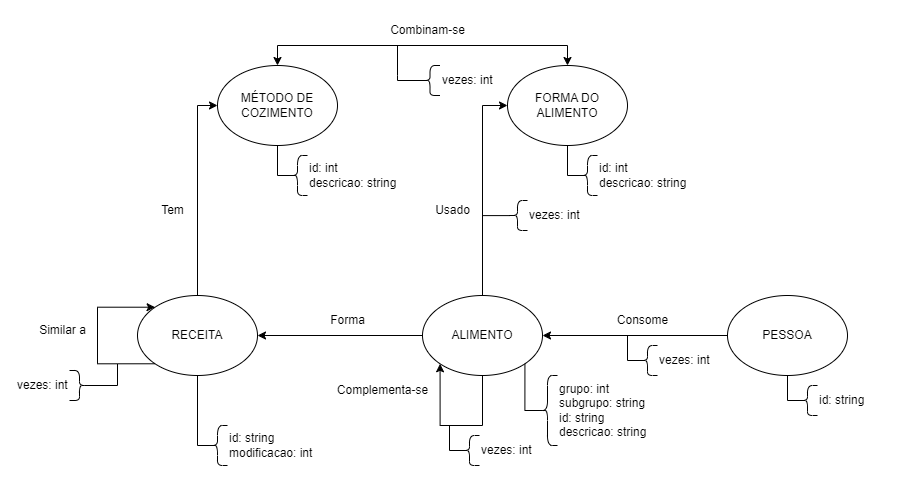

# Lab07 - Modelo Lógico para Banco de Dados de Grafos

# Equipe `Analistas de Cardápios`

# Subgrupo `A`
* `Pedro Henrique Antoine Cortez Daccache - 251572`
* `André Rodrigues Alves da Silva - 231392`
* `Gabryel Rodrigues Alves da Silva - 235394`

## Modelo Lógico do Banco de Dados de Grafos

## Perguntas de Pesquisa/Análise

* Quais são as receitas mais similares, considerando como critério de similaridade a quantidade de alimentos em comum que essas receitas usam?
* É possível criar grupos para os alimentos a partir das receitas em que são usados juntos?
* É possível definir um critério de importância para cada alimento com base na dieta das pessoas?