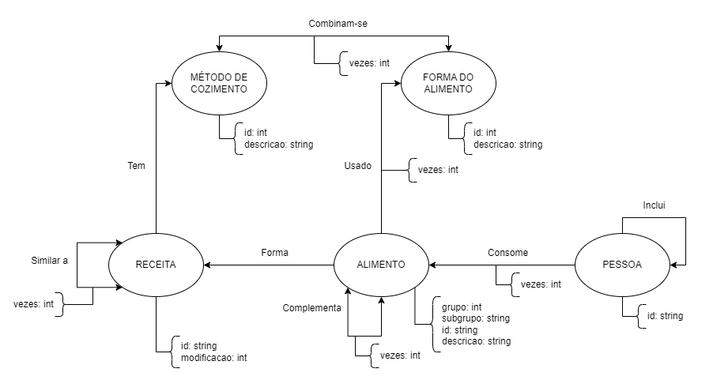

# Lab08 - Modelo Lógico e Análise de Dados em Grafos

# Equipe `Analistas de Cardápios`

# Subgrupo `A`
* `Pedro Henrique Antoine Cortez Daccache - 251572`
* `André Rodrigues Alves da Silva - 231392`
* `Gabryel Rodrigues Alves da Silva - 235394`

## Modelo Lógico do Banco de Dados de Grafos

## Perguntas de Pesquisa/Análise Combinadas e Respectivas Análises

### Pergunta/Análise 1
* Pergunta 1

   * Análise com link prediction...

### Pergunta/Análise 2
* Pergunta 2

   * Comunidades...

### Pergunta/Análise 3
* Pergunta 3

   * Centralidade/PageRank...

### Pergunta/Análise 4
* Pergunta 4

   * ...